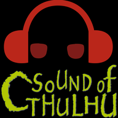

# 



Sound management tool for TRPG session

## Tools version
- Node.js 11.13.0
- npm 6.9.0
- yarn 1.16.1
- vue-cli 3.8.2

## Project setup

```sh
yarn install
```

### Compiles and hot-reloads for development

```sh
yarn electron:serve
```

### Compiles and minifies for production

```sh
yarn electron:build
```

### Run your tests

```sh
yarn run test
```

### Lints and fixes files

```sh
yarn run lint
```

### Customize configuration
See [Configuration Reference](https://cli.vuejs.org/config/).

## Sample sound
- 至福の隙間([魔王魂](https://maoudamashii.jokersounds.com/))
